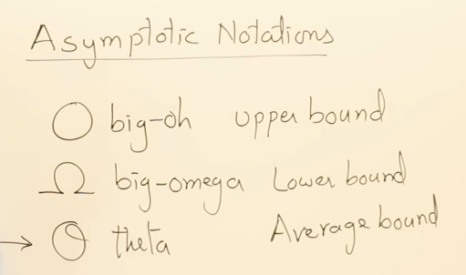
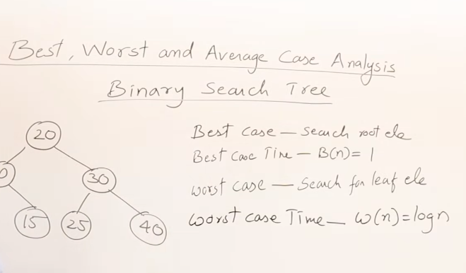

https://www.youtube.com/watch?v=A03oI0znAoc&list=PLDN4rrl48XKpZkf03iYFl-O29szjTrs_O&index=11

Need to watch 1.8.2
--------------------------

1.11 Best Case and Worst Case analysis

Best Case : searching key element present at first index
Best Case Time -- 1 O(1)
                B(n) = O(1)

                                             
Worst case : searching a key at last index 

Worst case time = n
W(n) = n

Average Case time --- all possible case time / no. of cases

== (n+1) / 2

cases are not related to notations.. notations are for functions .. 
cases are the gist of type of analysis done on algorithm 

For Binary Search Tree

Best Case - Search root element
Best case time - B(n) = 1
Worst Case - Search for leaf element
Worst Case Time - W(n) = log n
---------------------------------
Min Worst case time W(n) = log n
Max Worst case time W(n) = n