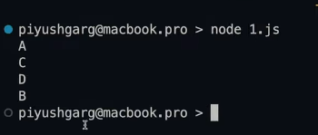
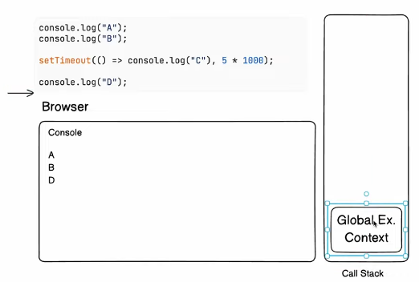

https://www.youtube.com/watch?v=kl7ActKCQIU&t=1797s




           
```
after execution global execution context 
is going to be deleted

call stack wait for none .. 

WebAPI's expose some importants things
(setTimeout, setInterval, fetch)
via browsers window object .. 

```


after 5 seconds 


```
event loop is continously watching the
task queue .. if something present in 
queue .. event loop picks that up 
and push that to call stack .. 

call stack execute that 
```
---
> event loop only pushes if call stack is empty

```
promises are also part of browser
```


https://www.youtube.com/watch?v=gPKzwAORly8
