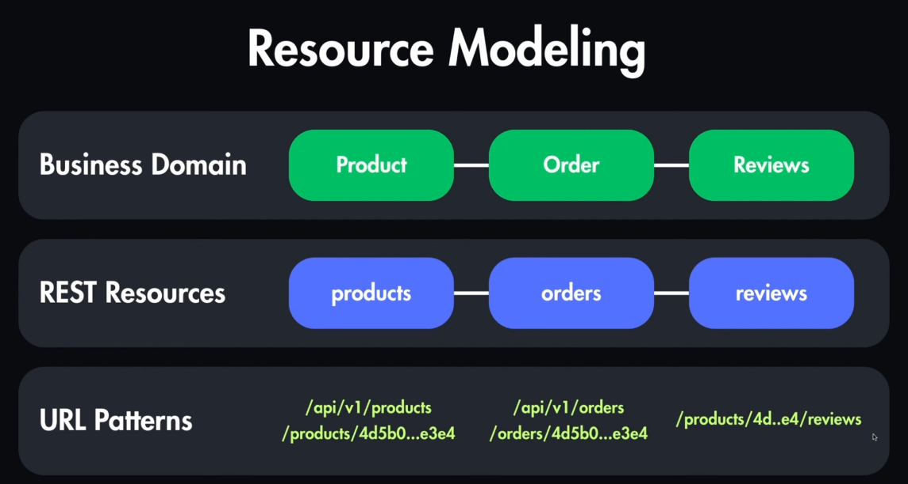

https://www.youtube.com/watch?v=PnQY02QQrYQ

---
#### 1. What make an API restful

```
     easy to consume .. predictable 

```
#### 1. What content negotiation is ? give me example

```
    http mechanism .. it allows client to choose which shape of request they want 
    accept hedder
```


#### 1. Diff between SQL vs NoSql
```


```

#### 1. Diff between GraphQL and REST
```


```

#### 1. Name Three SOLID PRINCIPLES
```
S -> Single Responsibility 
L -> Liscove Substitution
O -> Open Close
I -> Interface Segregation
D -> Dependency Injection

```

https://www.youtube.com/watch?v=7iHl71nt49o
#### Need to watch this video .. Must 





