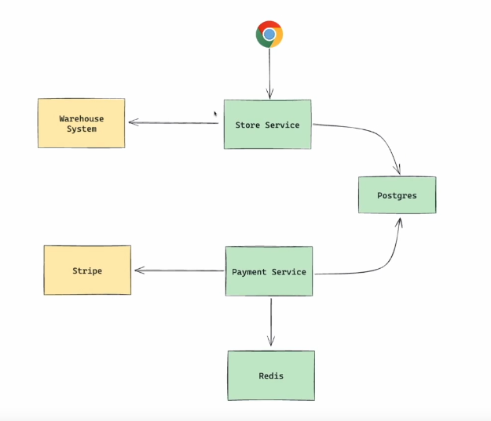

https://www.youtube.com/watch?v=3O5UMAGEnhw

---
#### 1. 

```ts
1. Functional Requirements (User Stories)
2. Non Functional
   - security
   - web performance, accessibility
   - scalability

   1 mil mostly user: 
   - geography
   - time distribution / peak traffic
   
   - product distribution ( most advertisement product has more traffic )
   - viral post have more traffic in social media
   - traffic number 
   1000000 / 31 / 2 / 60 / 60 - request per second (rps)
   - google analytics helps us to get numbers
   - measure Throughput


3. Backend Store Service
    - CPU 
    horizontal scaling, 
    vertical scaling - shutdown the server .. add more capability to it - not practical now a days - it has downtime . not elastic .. 

    - Make sure we have separate Database for each service.. 
    as DB is hard to scale
    


```


