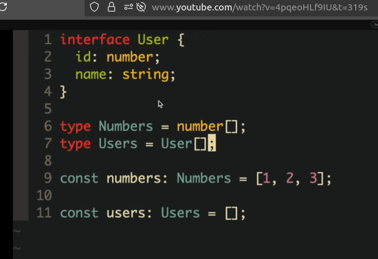
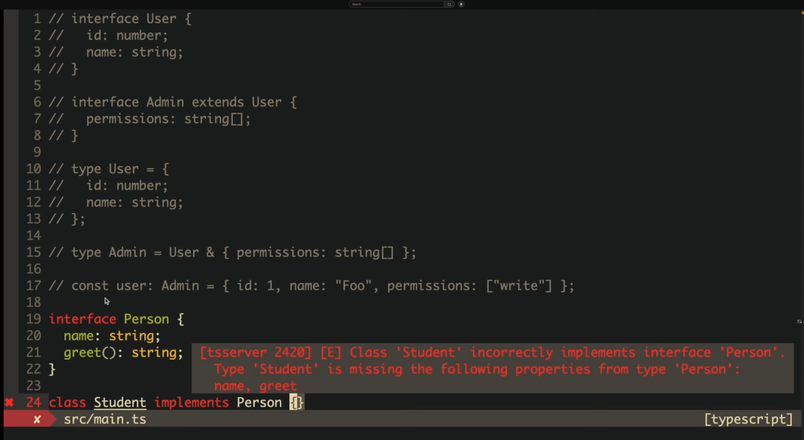
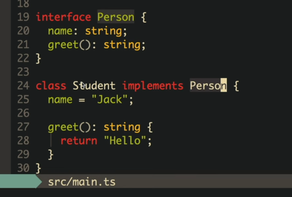

---
#### 1. What is Ts

```ts

strongly typed programming language. dev by microsoft..  
add some nice feature on top of javascript .. 
new syntax and types... 
```

---
####  . Different Component in Typescript

```ts
compiler  

```

---
####  . Why we use Ts

```ts
 

```

---
####  . Access Modifiers in Ts

```ts
default -- all other class and parts of your code can access this property

private -- only the class that hold that method or property can access that 

protected -- that class and sub classes can access that 
```

---
####  . What type did TS add to JS

```ts
Js already have some different type .. like string, object etc

in ts we have tuples , and types that we can define ..
also interfaces that can be used as type kind of thing

```

---
####  . Type Vs Interface .. Tell UseCases

```ts
TS types are bit strict because .. we can not extend that ..
but they can be intersected to create new types

But now can we extend types also .. 

interface User {
    id:number;
    name? : string
}

const user : User = {
    id: 1
}

function getName = (user : User) => {
    return user.name
}

getName(user);

----------------------------------------

Lets Talk about Type

```




---
####  . What are generic Type in TS

```ts
We can pass types as variable .. 

```

---
####  . Structural Typing in TS

```ts


```

---
####  . Rules of Private Fields

```ts
hidden thing in TS Class

```

---
####  . choose between never any 

```ts
never -> objectively say, a variable will never have a type .. 
any -> any does not do any type check.... Any allows you to perform any operation on a value without any type checking
unknown -> that variable has some sort of types .. either string or unknown ..
unknown requires you to perform type checking before performing any operations on the value.

never ->  
When you assign a type never, you cannot reassign it to any other type, including an object.

lets say i declare a variable .. never .. i assign integer .. can i assign string to this 
```

---
####  . When to use declare keyword in Typescript .. 

```ts
when Ts itself does not know the type of a certain method or variable or the library 
you importing from , does not have type .. 

if a library does not have type .. So, Typescript does not have way to figure out 
what the parameter type of that function receive or type of the returning object .. 

do, we can use declare keyword to declare types for that library .. 
so that typescript do not scream .. let you pass 

```

---
####  . What are ambience in Typescript

```ts
An ambient declaration is a way to tell the TypeScript compiler about the existence of a value that is not written in TypeScript, such as a global variable or a third-party library.


Ambient declarations in TypeScript allow you to provide type information for external libraries, global variables, or other non-TypeScript code. 

To use ambient declarations, you create `.d.ts` files where you define the ambient types. These declaration files should be included in your TypeScript project so that the compiler can recognize and apply the type information.

Overall, ambient declarations in TypeScript enable better type-checking and tooling support in projects that involve external entities.

```

---
####  . 

```ts
const foo :string = "FOo";

const users: Array<{id:number; name:string}> = [{id:1,name:"a"}];


const users1: {id:number; name:string}[] = [{id:1,name:"a"}];

// same thing .. 

```

---
####  . write a function getFullName which gets name and surname and returns a full name 

```ts


```


---
####  . What is union in Typescript 

```ts


```


