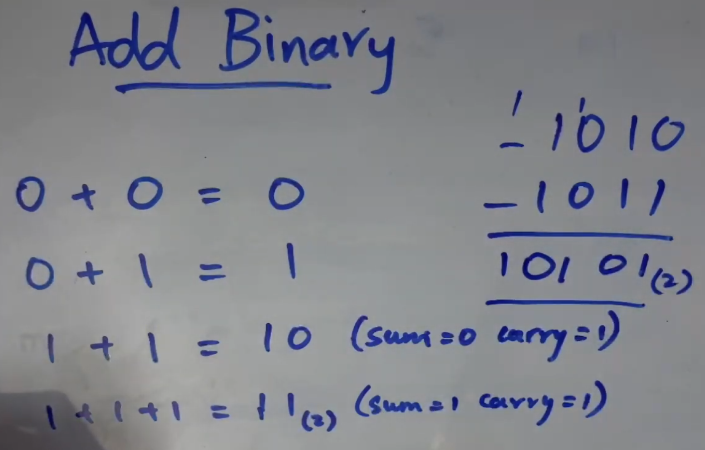
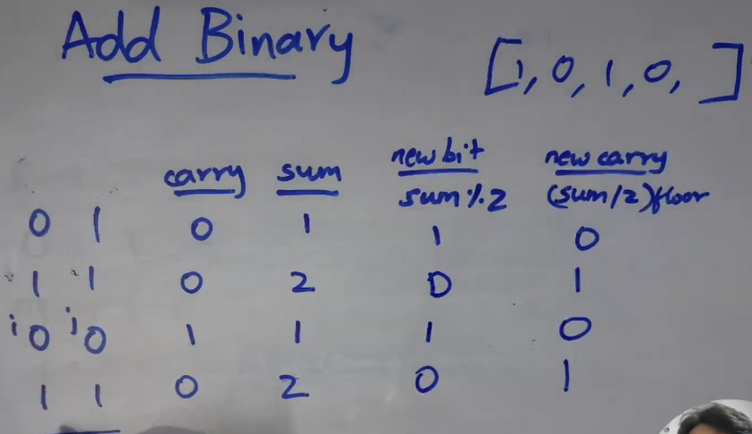

use 2 pointer to solve this problem





```ts

let addBinary = function(a,b){
    let i = a.length - 1 // point last element of a
    let j = b.length - 1 // point last element of b 

    let carry = 0;

    let result = []

    while(i >= 0 || j >= 0 || ) {
        const bitA = parseInt(a[i])
        const bitB = parseInt(b[j])

        const sum = bitA + bitB + carry

        result.push(sum % 2)

        carry = Math.floor(sum / 2)

        i--
        j--

    }
    return result.reverse().join("");
}

```