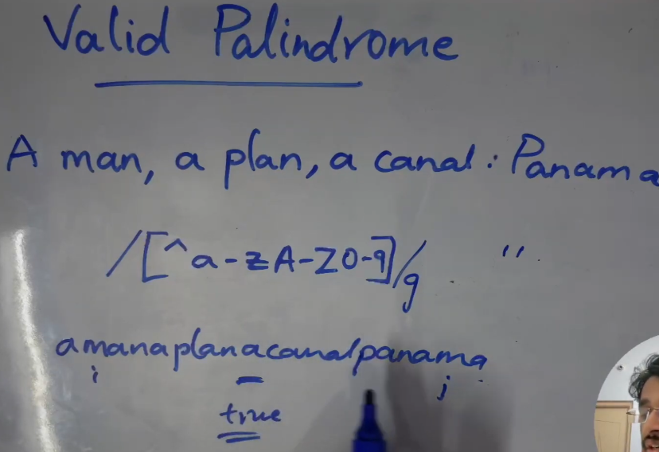

A man, a plan, a canal: Panama

> filter out all the comma, white spaces by regular expression

```ts
/[^a-zA-Z0-9]/g

```


```ts

let isPalindrome = function(s) {
    const cleansedStr = filterAlphaNumeric(s);
    // set two pointer
    let i = 0; let j = cleansedStr.length-1
    while(i<j){
        if(cleansedStr[i] !== cleansedStr[j]){
            return false
        }
        i++ 
        j--
    }
    return true 
}

const nonAlphaNumeric = /[^a-z0-9]/gi
 
function filterAlphaNumeric(s){
    return s.toLowerCase().replace(nonAlphaNumeric, '')
}

```