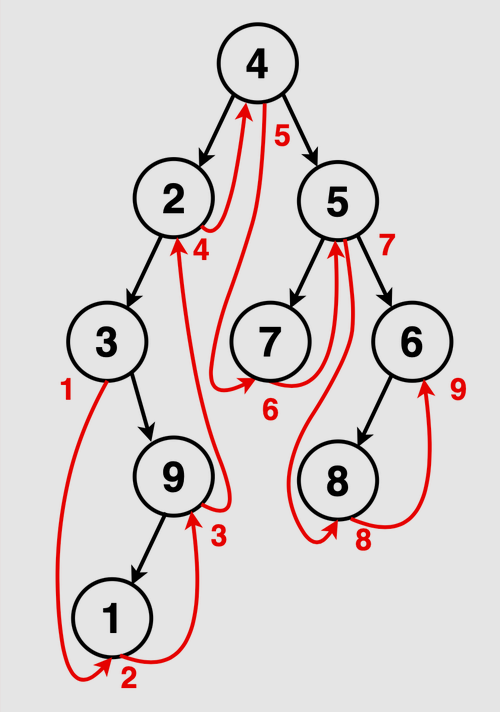

We traverse the binary tree in the order of Left, Root then Right recursively 

 depth-first traversal techniques 
 left child, root node, right child

 in order : https://youtu.be/Z_NEgBgbRVI 

 https://takeuforward.org/data-structure/inorder-traversal-of-binary-tree/

 post order  : https://youtu.be/RlUu72JrOCQ

 https://takeuforward.org/data-structure/preorder-traversal-of-binary-tree/ 