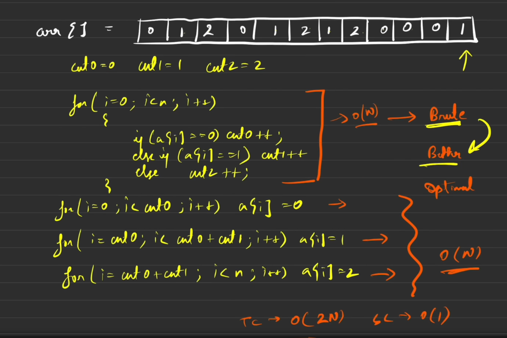

[Video Link](https://www.youtube.com/watch?v=tp8JIuCXBaU&list=PLgUwDviBIf0oF6QL8m22w1hIDC1vJ_BHz&index=21)


[Note](https://takeuforward.org/data-structure/sort-an-array-of-0s-1s-and-2s/)

arr[] = [0, 1, 2, 0, 1, 2, 2,1, 2, 0, 0, 1]


if we use merge sort [^ref1]
timeComplexity NlogN
space Complexity O(n) // as we use temp array during merge sort 

> interviewer will not be happy NlogN and extra space you are using
> he will ask you to optimize this 

---


#### Better Solution 

```
as array contains 0, 1, 2 .. 
have 3 variables .. count0, ct1, ct2
run a single iteration 
increase count of those variables

run a loop count0 times and manually
override values to 0,

same goes for count1 and count2

```

lets think about time complexity
: 
 
> hei you taking O(2n) .. that means 
> 2 iterations .. i dont need 2 iterations .. can you further optimize this 
 
---

#### Optimal Solution -- 5:16

```
Dutch National Flag Algorithm

this algo using 3 pointers .. low, mid, high

algo revolving around 3 rules 

+ [0 .. low-1] ➡️ 0  extreme left 
+ [low .. mid-1] ➡️ 1   
+ [high .. n-1] ➡️ 2 extreme right


```


- [x] Write the press release

[^ref1]: reference

[Need Emoji](https://dev.to/nikolab/complete-list-of-github-markdown-emoji-markup-5aia)
