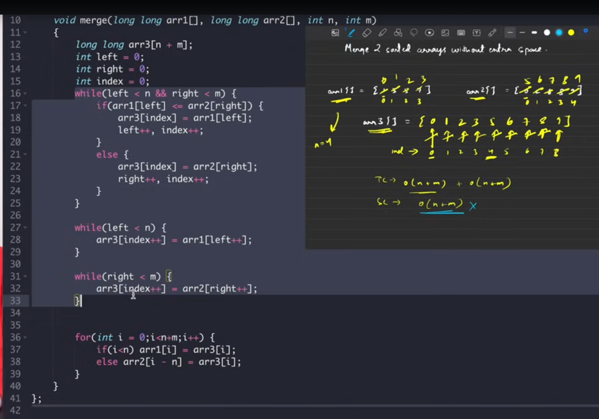
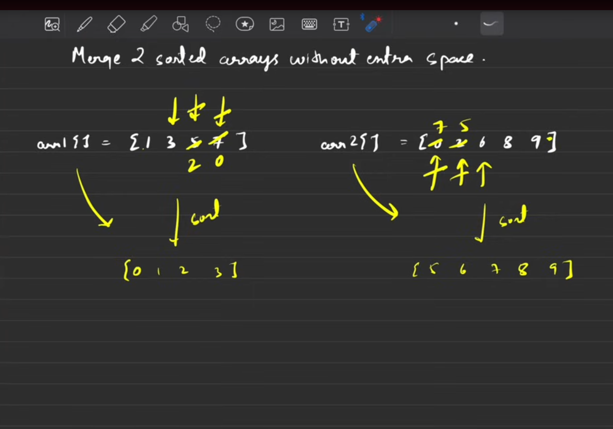
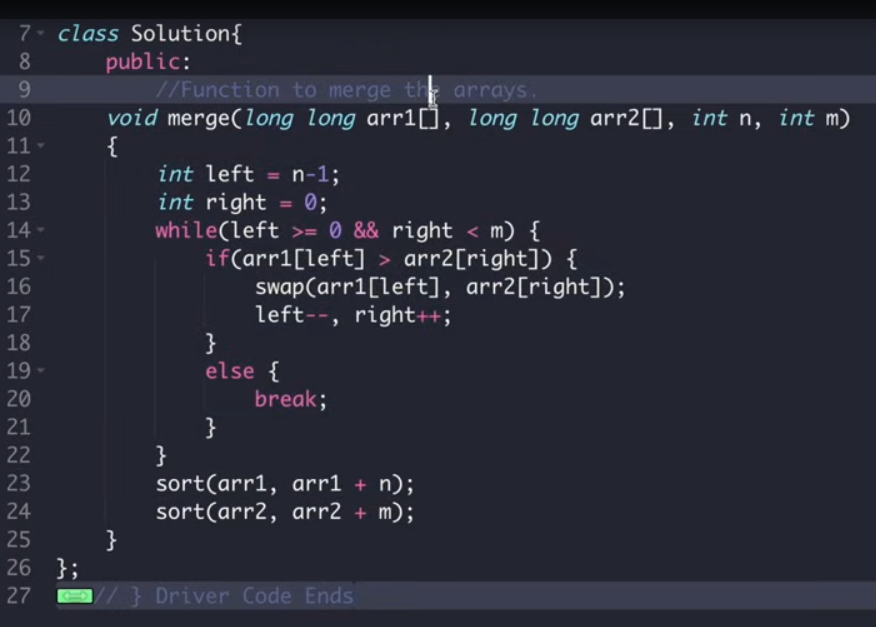

[^goToTop]
[Video Link](https://www.youtube.com/watch?v=n7uwj04E0I4)


[Note](https://takeuforward.org/data-structure/merge-two-sorted-arrays-without-extra-space/)

arr1[] = [1, 3, 5, 7]  arr2[] = [0, 2, 6, 8, 7]

without extra space .. we have to sort and merge this 2 arrays

re shuffle this array in such an order so that it become
sorted

>  

---
#### 1. Brute Force




#### 1. 1st Optimal Solution 

```
check both arrays each element and ..
compare them .. keep small in one array and big in other array. 

after that .. sort both arrays...

```



```
TC -> 
 O(min(n,m)) +  // one of the array can be  shorter
 O(n log m) + // for sorting first array
 O(m log m) // for sorting second array

SC -> O(1)


```

#### 1. 2nd Optimal Solution  : 15:49