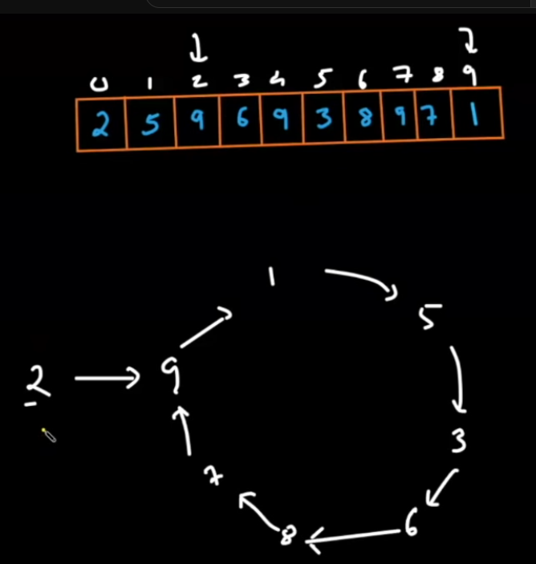

[^goToTop]
[Video Link](https://www.youtube.com/watch?v=32Ll35mhWg0&list=PLgUwDviBIf0rPG3Ictpu74YWBQ1CaBkm2&index=2)


[Note](https://takeuforward.org/data-structure/find-the-duplicate-in-an-array-of-n1-integers/)

#### Problem

Find the duplicate .. 

> must not modify the array(assume array is read only)
 must use only constant, O(1) extra space. 
 runtime complexity should be less than O(n2)

---
#### 1. Brute Force Solution

```
sort the array 

linearly traverse an array .. 
if value of the index i and index i+1 is same ..
then duplicate found .. 

tc -> O(n log n) // merge sort to sort this 
sc -> O(1) // extra space .. 

```

> optimize our first solution using hashing .. 

```
we need to create a frequency array of similar size .. 
all initialized with 0

------

we linearly traverse given array .. lets say 
given array's first element is 2 .. then

we update hashmap's index 2  by 1 .. 

tc -> O(n) // we improve time complexity here ..  
sc -> O(n)  // we use some extra space here .. 

```

#### 3. Most Optimal Solution .. (linked list cycle method) 2:58 



```
first we have the first value (for example 2) of given array ..
next we have move to that number index .. like for this case
2nd index and get that value ..  

after creating a cycle .. we have to use tortoise method ...

we are gonna take 2 pointer .. 

one of slow pointer and another
one is fast pointer .. 

slow pointer always move one step and 
fast pointer always move two step

when slow and fast pointer collide.

you are going to stop moving and take the fast pointer 
to the first number 

now move the fast and slow pointer by one point
that is duplicate number

```
> - ------------  5:41


