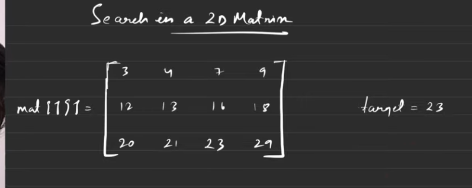
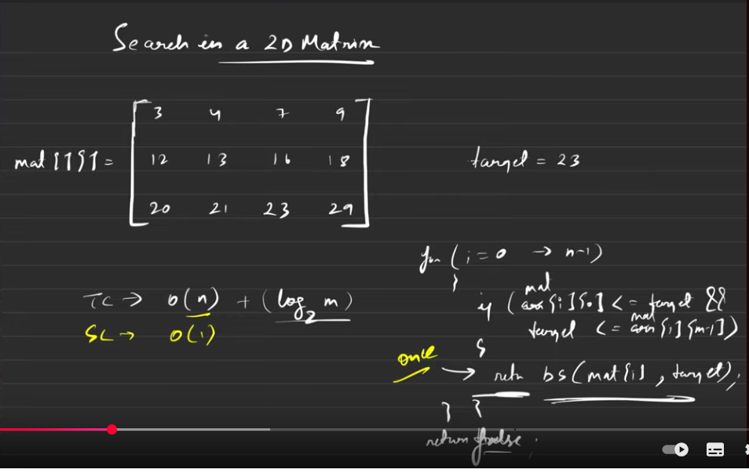

[^goToTop]
[Video Link](https://www.youtube.com/watch?v=JXU4Akft7yk)


[Note]()

#### Problem

Binary Search of 2D

Given a sorted matrix
Given Target is in the matrix or not .. 


> 

---
#### 1. Extreme Naive Solution

```
Run 2 for loop to iterate through the matrix and check target is 
matched or not

Tc -> O(n * m)
Sc -> O(1)

```
#### 2. Better Approach 2:09




```

binary search in a 1D array

Tc -> O(n) + log2(M)  // we can still optimize this ..
Sc -> O(1)

```

#### 3. Lets More Optimize 6:06 easy

```
flatten a 2D into 1D .. then it become (n * m)


```
