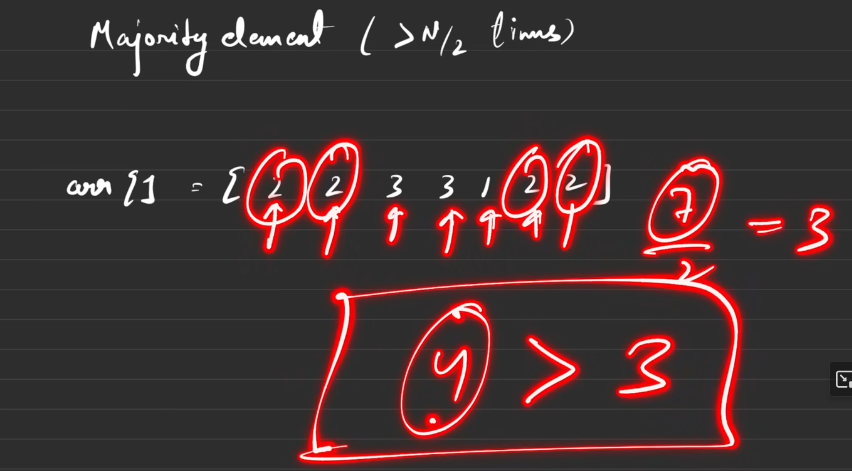
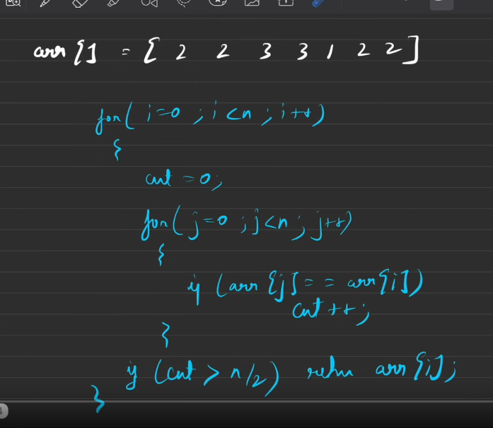

[^goToTop]
[Video Link](https://www.youtube.com/watch?v=nP_ns3uSh80)


[Note]()

#### Problem

Majority Element ( > N/2 times ) 

arr [] = [ 2 2 3 3 1 2 2 ]


>

---
#### 1. Brute Force Solution



```

```

---
#### 2. Better Solution

```ts

as brute force taking O(n^2)

so better solution can be O( n log n)
or O(n)


we are counting .. and we are looking for which element 
appears more than N/2 times

We can use **Hashing** ...

```